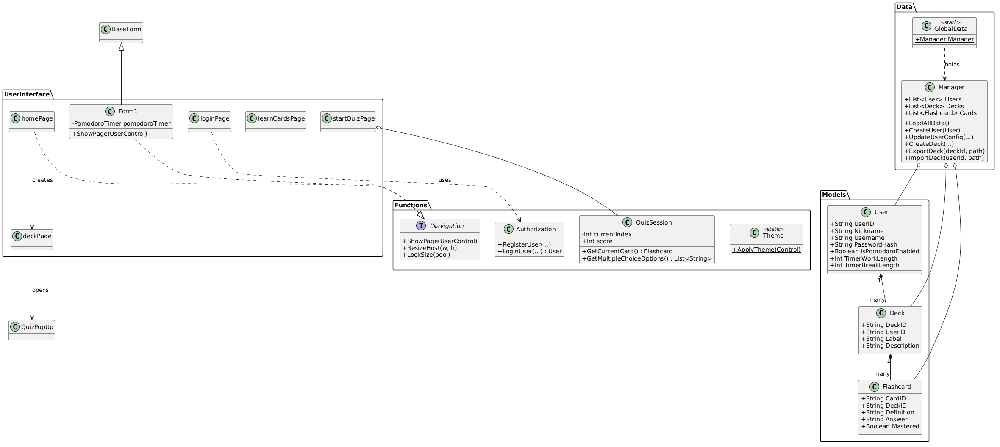

# FlashWise: Smart Flashcard and Quiz Learning System with Progress Tracking and Pomodoro Timer


## Project Description and Purpose
FlashWise is a Smart Flashcard and Quiz Learning System developed using C# Windows Forms Application. The system is designed to help students improve their study habits, learning efficiency, and time management through interactive learning tools.

The application combines flashcards, quizzes, progress tracking, and a Pomodoro timer into a single platform to promote active recall, spaced repetition, and focused studying. Users can create and manage study materials, take quizzes, monitor their learning progress, and manage study sessions effectively.

The system aims to address common academic problems such as ineffective studying, poor organization of learning materials, lack of time management, and difficulty retaining information.

This project is developed as a requirement for CS 222 – Advanced Object-Oriented Programming.

---

# Purpose of the System

The main purpose of the system is to:

- Help students organize their study materials efficiently
- Improve knowledge retention through flashcards and quizzes
- Encourage active recall and self-assessment
- Provide progress tracking for learning performance
- Support time management using the Pomodoro Technique
- Apply Object-Oriented Programming principles in a real-world application

---

# UML Diagram



### Applied OOP Principles
* **Encapsulation:** Managed through the `Manager` class, which isolates database logic (SQLite) from the UI. User credentials are secured using BCrypt hashing.
* **Inheritance:** Standardized UI behavior is achieved by having all forms and pop-ups inherit from a specialized `BaseForm`.
* **Abstraction:** Navigation and page-switching are abstracted via the `INavigation` interface, allowing decoupled communication between UserControls and the main Host Form.
* **Polymorphism:** The `ShowPage()` method is implemented across different host containers, allowing for flexible UI rendering depending on the current context (Main App vs. Quiz Pop-up).

---

## Features and Functionalities

1.  **Secure Authentication:** User registration and login featuring encrypted password storage.
2.  **Deck & Card CRUD:** Full management of study materials including descriptions and labels.
3.  **Active Recall System:** Interactive flashcard interface with "Mastery" toggles.
4.  **Dynamic Quiz Engine:** * **Multiple Choice:** Automatically pulls wrong answers from other cards in the deck.
    * **Identification:** Requires text matches for rigorous testing.
    * **Smart Filtering:** Option to exclude "Mastered" cards to focus on weak areas.
5.  **Global Pomodoro Timer:** * Customizable Work/Break intervals.
    * UI Lock-out during mandatory breaks to prevent burnout.
6.  **Data Portability:** Export and import decks as `.json` files for backup or sharing with other users.

---

## Technologies Used

| Technology | Implementation |
| :--- | :--- |
| **C# / .NET** | Programming language and runtime |
| **WinForms** | GUI Framework |
| **SQLite** | Local relational data storage |
| **BCrypt.Net** | Password security and hashing |
| **System.Text.Json** | Data serialization for deck sharing |
| **GitHub** | Version control and repository hosting |
| **Visual Studio** | Development environment |

---

# Explanation of How the Program Works

## Step 1: User Authentication
Users create an account or log in using their credentials.

## Step 2: Dashboard Access
After login, users are redirected to the main dashboard where they can access:
- Flashcards
- Quiz System
- Pomodoro Timer

## Step 3: Flashcard Learning
Users create flashcards and study them through flip-card interaction and keyboard navigation.

The system tracks flashcard progress by checking the Mastered checkbox.

## Step 4: Quiz Setup
Users can start quizzes base on their flashcards. Users can also select the quiz type and number of items.

## Step 5: Progress Tracking
The system monitors user learning performance and flashcard progress.

## Step 6: Pomodoro Timer
Users can start study sessions using the Pomodoro Timer while reviewing flashcards or taking quizzes. 

## Step 7: Import and Export Decks
Users can import premade flashcard decks to quickly access study materials without manually creating flashcards.

The system also allows users to export their own flashcard decks for:
- Backup purposes
- Sharing with classmates
- Reusing study materials in the future

Imported decks are automatically added to the flashcard management system and categorized properly for easier studying.

---

# Instructions on How to Run the Application

## Requirements
- Windows Operating System
- Visual Studio 2022 or later
- .NET Framework

# How to Run the Application

1. Download or clone the repository:

```bash
https://github.com/Varradas/WinForms-Flashcards.git
```

2. Open the project folder in Visual Studio.

3. Open the solution file:

```text
StudySync.sln
```

4. Build the project by clicking:

```text
Build → Build Solution
```

5. Run the application by pressing:

```text
F5
```

6. Register an account and start using the system.

# Project Structure
```
📂FlashWise
└── 📂Flashcard WinForm App/
│    ├── 📂Data/
│    │   ├── 🛢️filedatabase.db
│    │   ├── 📄DBInitializer.cs
│    │   ├── 📄DBPath.cs
│    │   ├── 📄GlobalData.cs
│    │   └── 📄Manager.cs
│    ├── 📂Functions/
│    │   ├── 📄 Authorization.cs
│    │   ├── 📄CardRepo.cs
│    │   ├── 📄DeckRepo.cs
│    │   └── 📄INavigation.cs
│    ├── 📂Models/
│    │   ├── 📄Deck.cs
│    │   ├── 📄Flashcard.cs
│    │   ├── 📄Settings.cs
│    │   └── User.cs
│    ├── 📂Properties/
│    │   ├── 📄Resources.resx
│    │   └── 📄Resources.Designer.cs
│    ├── 📂UserInterface/
│    │   ├── 📄PomodoroTimer
│    │   ├── 📄deckPage
│    │   ├── 📄editCardPage
│    │   ├── 📄homePage
│    │   ├── 📄learnCardsPage
│    │   ├── 📄loginPage
│    │   ├── 📄registerPage
│    │   ├── 📄settingsPage
│    │   └── 📄startQuizPage
│    ├── 📄AddCardPopUp
│    ├── 📄EditCardPopUp
│    ├── 📄Flashcard WinForm App.csproj
│    ├── 📄Form1
│    ├── 📄Program.cs
│    ├── 📄QuizPopUp
│    └── 📄SplashScreen
└── 📂Images/
│    └── 📄umlv2.png
├── .gitattributes
├── .gitignore
├── BSU project.slnx
└── README.md
```

# Developers

## Team Name: ENIGM4

| Name | Role | Responsibility |
|------|------|------|
| Berana, Jon Paul S. | Front-End Developer | User Interface Design and Navigation |
| De Castro, Vinz Gabriel S. | Back-End Developer | System Logic and Database Integration |
| De Castro, John Christian N.| Documentation Developer | Project Documentation and Repository Management |
| Mendoza, John Laurence M. | Project Manager | Project Coordination, READme file Coordinator, and Testing |

---

# Acknowledgment

The developers would like to express their gratitude to the College of Informatics and Computing Sciences and to our instructor, Ms. Fatima Marie P. Agdon, for the guidance, support, and knowledge provided throughout the development of this project.

This project was developed as a requirement for:

**CS 222 – Advanced Object-Oriented Programming**  
2nd Semester, AY 2025–2026

